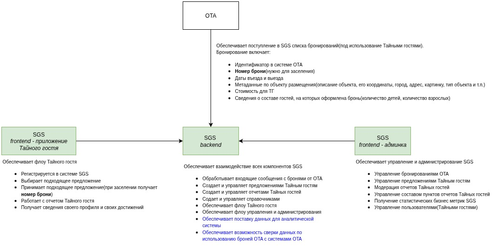

# Secret Guest Service

## Содержание
- [Основная идея](#idea)
- [Технологии](#technology)
- [Архитектура системы](#arch)
- [Фронтенд](#front)
- [Сценарий работы](#scenarios)
- [Роли пользователей](#user_roles)
- [Функциональная схема](#fdg)
- [Основные сущности (таблицы)](#base_entities)
- [Документация API](#api_docs)
- [Запуск проекта](#deploy)
- [TODO List](#todo)


<a name="idea"><h2>🚀 Основная идея</h2></a>

OTA-сервисы (Островок, Booking, Airbnb и др.) передают системе бронирования, которые распределяются между тайными гостями. Тайный гость выбирает подходящее предложение, заселяется и проходит процедуру инспекции объекта.  
Результат инспекции фиксируется в отчёте с текстовыми комментариями, оценками и медиафайлами.  


<a name="technology"><h2>🛠️ Технологии</h2></a>

- **Backend:** Go + PostgreSQL  
- **Frontend:** React (адаптивный дизайн)  
  - Админка (для модерации и управления контентом)  
  - Приложение тайного гостя (браузерное, мобильная адаптация)  
- **API:** REST (синхронное взаимодействие фронта и бэка)  
  - **swagger** документация API
- **Контейнеризация:** Docker + Docker Compose  
- **Хранение медиа файлов** Облачный сервис ImageKit
- **Скрипты:** Makefile для автоматизации  


<a name="arch"><h2>⚙️ Архитектура системы</h2></a>

Компоненты:
1. **Бэкенд (Go)** — реализация бизнес-логики, REST API, работа с базой данных.  
2. **PostgreSQL** — хранение данных системы.  
3. **Фронтенд (React)** — веб-приложения:  
   - интерфейс тайного гостя,  
   - административная панель.  
4. **Docker** — сборка и запуск сервисов.  
5. **ImageKit** — хранение медиа файлов.  


<a name="front"><h2>🖥️ Фронтенд</h2></a>

- **Админка** — управление отчётами, бронированиями, контентом.  
- **Приложение тайного гостя** — браузерное приложение (адаптивное), доступ к предложениям и заполнению отчётов.  


<a name="scenarios"><h2>📌 Сценарий работы</h2></a>

1. **Регистрация бронирований:**  
   OTA сервисы передают список бронирований (локация, стоимость, даты, состав гостей).  
2. **Формирование пула предложений:**  
   Система создаёт пул доступных предложений. Тайный гость может выбрать только одно.  
3. **Выбор и активация:**  
   - Гость выбирает предложение → оно исчезает из общего пула.  
   - Можно отказаться от выбора → предложение возвращается в пул.  
   - Активация брони возможна за 23 часа до заселения.  
4. **Отчёт тайного гостя:**  
   - Чеклист с тематическими секциями (лобби, кухня, общая зона и т.п.).  
   - Ответы: текст, оценка, комментарий, фото.  
   - Отчёт можно сохранить, продолжить позже или финализировать.  
5. **Модерация отчётов:**  
   - Отчёты проверяются в админке.  
   - Ошибочные предложения или бронирования можно скрыть.  


<a name="user_roles"><h2>👥 Роли пользователей</h2></a>

* Администратор — модерация отчётов, управление данными.
* Тайный гость — выбор предложений, заполнение отчётов.
* Персонал — управление бронированиями, модерация отчётов.


<a name="fdg"><h2>Функциональная схема</h2></a>




<a name="base_entities"><h2>🗄️ Основные сущности (таблицы)</h2></a>

- **Объекты размещения**  
  - listing_types — типы объектов  
  - listings — объекты  

- **Предложения и бронирования**  
  - assignment_statuses — статусы предложений  
  - assignments — предложения  
  - assignment_declines — отказы от предложений  
  - ota_sg_reservation_statuses — статусы бронирований OTA  
  - ota_sg_reservations — бронирования OTA  

- **Чеклисты и отчёты**  
  - answer_types — типы ответов  
  - media_requirements — требования к медиа  
  - checklist_sections — секции чеклиста  
  - checklist_items — пункты чеклиста  
  - report_statuses — статусы отчётов  
  - reports — отчёты  

- **Пользователи**  
  - roles — роли пользователей  
  - users — пользователи  
  - user_profiles — профили пользователей  


<a name="api_docs"><h2>📖 Документация API</h2></a>

* Краткое описание API: [api_endpoints_description.txt](backend/docs/api_endpoints_description.txt)
* Каталог swagger: [swagger](backend/api/swagger/)
* При запущенном бэкенде: _http://[address]:[port]/swagger/index.html_ (например: http://localhost:8000/swagger/index.html)

## Пример файлов с бронированиями от OTA

* Пример №1: [reservation1.json](backend/docs/Примеры%20сообщений%20от%20OTA/reservation1.json)
* Пример №2: [reservation2.json](backend/docs/Примеры%20сообщений%20от%20OTA/reservation2.json)


<a name="deploy"><h2>🐳 Запуск проекта</h2></a>

#### 1. Склонируйте репозиторий

```
git clone https://github.com/ostrovok-hackathon-2025/koshka-musya
```
В каталоге `backend` создайте `.env` файл с переменными окружения(на основе содержимого `.env.example`).


#### 2. Запуск с использованием технологии виртуализации 

* Установите Docker(можно Docker Desktop). Если у вас Windows, то сперва нужно установить WSL2.
* Установите Docker Compose.
* Установите утилиту Make, для автоматизации действий по сборке и запуску приложений
* Перейдите в каталог проекта и выполните последовательно команды:

```
# Команду сборки образов(может занять время): 
make build

# Команду запуска проекта
make up
```

Если сборка и запуск приложений в контейнерах прошли успешно, то:
* фронтенд будет доступен из браузера по адресу - `http://localhost:8080`
* бэкенд будет доступен по адресу - `http://localhost:8000`
* swagger докуументация будет доступна по адресу - `http://localhost:8000/swagger/index.html`

При необходимости остановки проекта, выполните команду:

```
# Команда остановки контейнеров с образами
make down
```

При необходимости удаления контейнеров с образами приложения, выполните:

```
# Команда остановки контейнеров с образами
make down

# Команда удаления остановленных контейнеров
make prune

# Команда удаления окружения. Удаления файла БД
make clean
```


<a name="todo"><h2>TODO List</h2></a>

Перечень идей бэклога, которые не успели реализовать в рамках хакатона:

* Ведение рейтинга объектов в SGS(в целом, это задача скорее OTA, но свой рейтинг изначально был в бэклоге).
* Ведение автоматической модерации отчетов ТАйных гостей с использованием LLM.
* Использование отдельной аналитической БД - собственно для аналитики, а так же персистентного хранения  броней ОТА, предложений, отчетов и т.п., для выполнения их ML-анализа, расчета бизнес метрик. 
  * Связанный функционал обмена данными с оперативно БД системы SGS(обновление профилей пользователей, рейтингов, предложений и т.п.).
* Механика заявок пользователей стать Тайными гостями.
* Механика автоматического закрытия "протухших"(т.е. истекших) броней ОТА, предложений и отчетов ТАйного гостя.
* Улучшение механик формирования схем отчетов как в технологическом, так и бизнес плане.
* Реализовать возможность обрабатывать брони сразу нескольких ОТА - необходимо прокинуть соответствующую сквозную аналитику(поле) по всем основным сущностям(брони ОТА, предложения и отчеты).
* Реализовать кэширование на стороне бэкенда.  
* Реализовать систему уведомлений и обмена сообщений с Тайными гостями.
* Реализовать обмен сообщениями(событиями) с ОТА(через адаптеры).
* Улучшение механик подборов и фильтрации данных на фронтенде для улучшения клиентского опыта.
* Поддержка мультиязычности.
* Переработать систему статусов основных сущностей.
* Реализовать систему холдирования броней ОТА.
* Добавить новые игровые механики.
